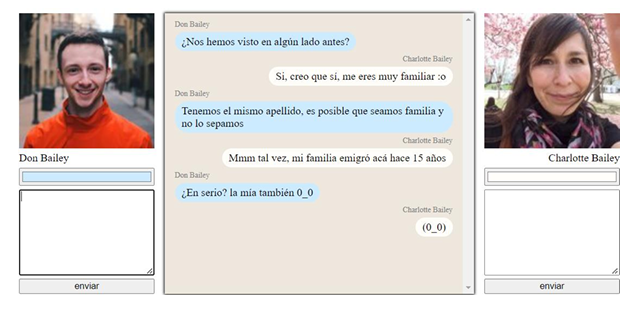

# Desafio - Consumo de datos desde una API REST

## Introducción

En este desafío validaremos nuestros conocimientos del consumo de API's. Para lograrlo, necesitarás usar el ciclo de vida de un componente para consumir una API justo luego de renderizar la aplicación.

## Descripción

Para poner a prueba tus conocimientos del consumo de API's deberás realizar una mini aplicación con temática de chat para permitir el diálogo entre 2 desconocidos.

Ambas personas deberán ser obtenidas a través de la API [Random User](https://randomuser.me/).

 

La aplicación debe cumplir lo siguiente:

-   Cada persona deberá poder enviar un nuevo mensaje al chat definiendo el contenido textual y un color representativo.
-   El chat que se visualiza al centro debe ser un componente hijo que se encargue de exponer todos los mensajes indicando el nombre del propietario en cada uno.
-   Apenas se cargue la aplicación, deberán cargarse 2 personas completamente aleatorias obtenidas por la API Random User.

## Requerimientos

1. Utilizar Axios para el consumo de datos de la API Random User.
2. Usar el ciclo de vida de los componentes para obtener la información de los usuarios al cargar la aplicación.
3. Utilizar los eventos para agregar las interacciones que permitan el registro de nuevos mensajes de chat.
4. Hacer uso del style y/o class binding paar el direccionamiento y el color de fondo de los mensajes según corresponda a su propietario.

## Tecnologías utilizadas
